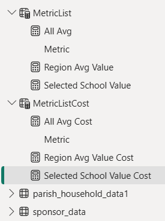
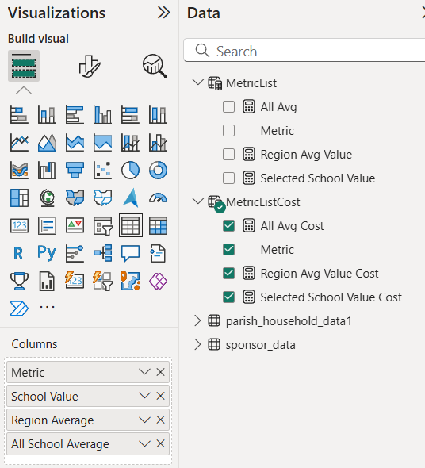
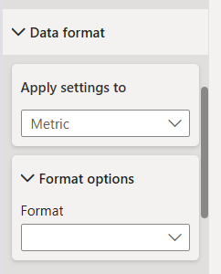

### DAX to create the dynamic table for each school

_Provides list of possible metrics for a slicer_

MetricListRevenue

_Disconnected table of measures(variables) to display_

MetricList = DATATABLE(
    "Metric", STRING,
    {
        {"Tuition per Student"},
        {"Total Revenue per Student"},
        {"Fundraising Parents Club Per Student"},
        {"Business Revenue Per"},
        {"Bequests Per Student"},
        {"Neighboring Parish Support Per Student"},
        {"Parish Support Direct Per Student"},
        {"Gift Revenue Per Student"},
        {"All Other Revenue Per Student"},
        {"Contribution Per Parish Household"},
        {"Expense to Revenue Ratio"},
        {"Discount Tuition Rate"},
        {"Diversity Score"},
        {"Percentage of Capacity Utilized"}
    }
)

_Calculates column for average for all schools_
_SWITCH() and SELECTEDVALUE() for which metric selected_
_CALCULATE(...REMOVEFILTERS(sponsor_data[School])) removes the school-level context_

All Avg = 
SWITCH(
    SELECTEDVALUE(MetricList[Metric]),
    "Tuition per Student", CALCULATE([NetTuitionPerStudent1], REMOVEFILTERS(sponsor_data[School])),
    "Total Revenue per Student", CALCULATE([RevenuePerStudent1], REMOVEFILTERS(sponsor_data[School])),
    "Fundraising Parents Club Per Student", CALCULATE([FundraisingParentsClubPerStudent1], REMOVEFILTERS(sponsor_data[School])),
    "Business Revenue Per",CALCULATE([BusinessRevenuePerStudent1], REMOVEFILTERS(sponsor_data[School])),
    "Bequests Per Student", CALCULATE([BequestPerStudent1], REMOVEFILTERS(sponsor_data[School])),
    "Neighboring Parish Support Per Student", CALCULATE([NeighboringParishSupportPerStudent1], REMOVEFILTERS(sponsor_data[School])),
    "Parish Support Direct Per Student", CALCULATE([ParishSupportDirectPerStudent1], REMOVEFILTERS(sponsor_data[School])),
    "Gift Revenue Per Student", CALCULATE([GiftRevenuePerStudent1], REMOVEFILTERS(sponsor_data[School])),
    "All Other Revenue Per Student", CALCULATE([AllRevenuePerStudent1], REMOVEFILTERS(sponsor_data[School])),
    "Contribution Per Parish Household", CALCULATE([RevPerParishHousehold1], REMOVEFILTERS(sponsor_data[School])),
    "Expense to Revenue Ratio", CALCULATE([ExpenseRevenueRatio1], REMOVEFILTERS(sponsor_data[School])),
    "Discount Tuition Rate", CALCULATE([DiscountTuitionRate1], REMOVEFILTERS(sponsor_data[School])),
    "Diversity Score", Calculate([RevenueDiversityAll1], REMOVEFILTERS(sponsor_data[School])),
    "Percentage of Capacity Utilized", CALCULATE([PercentCapacity1], REMOVEFILTERS(sponsor_data[School])),

    BLANK()
)

_Calculates column for average for region selected school is in_
_SWITCH() and SELECTEDVALUE() for which metric selected_
_CALCULATE(...REMOVEFILTERS(sponsor_data[School]), sponsor_data[Region] = SelectedRegion) removes the school-level context add region filter_ 

Region Avg Value = 
VAR SelectedRegion = SELECTEDVALUE(sponsor_data[Region])
RETURN
SWITCH(
    SELECTEDVALUE(MetricList[Metric]),
    "Tuition per Student", CALCULATE([NetTuitionPerStudent1], REMOVEFILTERS(sponsor_data[School]), sponsor_data[Region] = SelectedRegion),
    "Total Revenue per Student", CALCULATE([RevenuePerStudent1], REMOVEFILTERS(sponsor_data[School]), sponsor_data[Region] = SelectedRegion),
    "Fundraising Parents Club Per Student", CALCULATE([FundraisingParentsClubPerStudent1], REMOVEFILTERS(sponsor_data[School]), sponsor_data[Region] = SelectedRegion),
    "Business Revenue Per",CALCULATE([BusinessRevenuePerStudent1], REMOVEFILTERS(sponsor_data[School]), sponsor_data[Region] = SelectedRegion),
    "Bequests Per Student", CALCULATE([BequestPerStudent1], REMOVEFILTERS(sponsor_data[School]), sponsor_data[Region] = SelectedRegion),
    "Neighboring Parish Support Per Student", CALCULATE([NeighboringParishSupportPerStudent1], REMOVEFILTERS(sponsor_data[School]), sponsor_data[Region] = SelectedRegion),
    "Parish Support Direct Per Student", CALCULATE([ParishSupportDirectPerStudent1], REMOVEFILTERS(sponsor_data[School]), sponsor_data[Region] = SelectedRegion),
    "Percentage of Capacity Utilized", CALCULATE([PercentCapacity1], REMOVEFILTERS(sponsor_data[School]), sponsor_data[Region] = SelectedRegion),
    "Gift Revenue Per Student", CALCULATE([GiftRevenuePerStudent1], REMOVEFILTERS(sponsor_data[School]), sponsor_data[Region] = SelectedRegion),
    "All Other Revenue Per Student", CALCULATE([AllRevenuePerStudent1], REMOVEFILTERS(sponsor_data[School]), sponsor_data[Region] = SelectedRegion),
    "Contribution Per Parish Household", CALCULATE([RevPerParishHousehold1], REMOVEFILTERS(sponsor_data[School]), sponsor_data[Region] = SelectedRegion),
    "Expense to Revenue Ratio", CALCULATE([ExpenseRevenueRatio1], REMOVEFILTERS(sponsor_data[School]), sponsor_data[Region] = SelectedRegion),
    "Discount Tuition Rate", CALCULATE([DiscountTuitionRate1], REMOVEFILTERS(sponsor_data[School]), sponsor_data[Region] = SelectedRegion),
    "Diversity Score", CALCULATE([RevenueDiversityRegion1], REMOVEFILTERS(sponsor_data[School]), sponsor_data[Region] = SelectedRegion),

    BLANK()
)

_Returns measure for currently selected school_

Selected School Value = 
SWITCH(
    SELECTEDVALUE(MetricList[Metric]),
    "Tuition per Student", [NetTuitionPerStudent1],
    "Total Revenue per Student", [RevenuePerStudent1],
    "Fundraising Parents Club Per Student", [FundraisingParentsClubPerStudent1],
    "Business Revenue Per",[BusinessRevenuePerStudent1],
    "Bequests Per Student", [BequestPerStudent1],
    "Neighboring Parish Support Per Student", [NeighboringParishSupportPerStudent1],
    "Parish Support Direct Per Student", [ParishSupportDirectPerStudent1],
    "Gift Revenue Per Student", [GiftRevenuePerStudent1],
    "All Other Revenue Per Student", [AllRevenuePerStudent1],
    "Contribution Per Parish Household", [RevPerParishHousehold1],
    "Expense to Revenue Ratio", [ExpenseRevenueRatio1],
    "Discount Tuition Rate", [DiscountTuitionRate1],
    "Diversity Score", [NormalizedRevenueEntropy1],
    "Percentage of Capacity Utilized", sponsor_data[PercentCapacity1],
    BLANK()
)

_Repeat for costs metrics_ 
MetricListCost

All Avg Cost = 
SWITCH(
    SELECTEDVALUE(MetricListCost[Metric]),
    "Salaries and Benefits", CALCULATE([TotalCompPerStudent1], REMOVEFILTERS(sponsor_data[School])),
    "Benefits % of Total Compensation", CALCULATE([PctBenefitsTotalComp1], REMOVEFILTERS(sponsor_data[School])),
    "Staff to Student Ratio", CALCULATE([StudentToStaffRatio1], REMOVEFILTERS(sponsor_data[School])),
    "Total Expense Per Student",CALCULATE(AVERAGE(sponsor_data[total_expenses_80_per_student]), REMOVEFILTERS(sponsor_data[School])),
    "Program Expenses Per Student", CALCULATE(AVERAGE(sponsor_data[program_expenses_per_student]), REMOVEFILTERS(sponsor_data[School])),
    "Supplies Per Student", CALCULATE(AVERAGE(sponsor_data[supplies_per_student]), REMOVEFILTERS(sponsor_data[School])),
    "% Change of Repairs/Maintenance", CALCULATE(AVERAGE(sponsor_data[pct_change_repairs]), REMOVEFILTERS(sponsor_data[School])),
    "Lowest Salary", CALCULATE(AVERAGE(sponsor_data[LowTSalary]), REMOVEFILTERS(sponsor_data[School])),
    "Fundraising Expense to Revenue", CALCULATE([FundraiseExpRevRatio1], REMOVEFILTERS(sponsor_data[School])),
    "Contracted Services Per Student", CALCULATE(AVERAGE(sponsor_data[contracted_services_per_student]), REMOVEFILTERS(sponsor_data[School])),
    BLANK()
)

MetricListCost = DATATABLE(
    "Metric", STRING,
    {
        {"Salaries and Benefits"},
        {"Benefits % of Total Compensation"},
        {"Staff to Student Ratio"},
        {"Total Expense Per Student"},
        {"Program Expenses Per Student"},
        {"Supplies Per Student"},
        {"% Change of Repairs/Maintenance"},
        {"Lowest Salary"},
        {"Fundraising Expense to Revenue"},
        {"Contracted Services Per Student"}
    }
)

Region Avg Value Cost = 
VAR SelectedRegion = SELECTEDVALUE(sponsor_data[Region])
RETURN
SWITCH(
    SELECTEDVALUE(MetricListCost[Metric]),
    "Salaries and Benefits", CALCULATE([TotalCompPerStudent1], REMOVEFILTERS(sponsor_data[School]), sponsor_data[Region] = SelectedRegion),
    "Benefits % of Total Compensation", CALCULATE([PctBenefitsTotalComp1], REMOVEFILTERS(sponsor_data[School]), sponsor_data[Region] = SelectedRegion),
    "Staff to Student Ratio", CALCULATE([StudentToStaffRatio1], REMOVEFILTERS(sponsor_data[School]), sponsor_data[Region] = SelectedRegion),
    "Total Expense Per Student",CALCULATE(AVERAGE(sponsor_data[total_expenses_80_per_student]), REMOVEFILTERS(sponsor_data[School]), sponsor_data[Region] = SelectedRegion),
    "Program Expenses Per Student", CALCULATE(AVERAGE(sponsor_data[program_expenses_per_student]), REMOVEFILTERS(sponsor_data[School]), sponsor_data[Region] = SelectedRegion),
    "Supplies Per Student", CALCULATE(AVERAGE(sponsor_data[supplies_per_student]), REMOVEFILTERS(sponsor_data[School]), sponsor_data[Region] = SelectedRegion),
    "% Change of Repairs/Maintenance", CALCULATE(AVERAGE(sponsor_data[pct_change_repairs]), REMOVEFILTERS(sponsor_data[School]), sponsor_data[Region] = SelectedRegion),
    "Lowest Salary", CALCULATE(AVERAGE(sponsor_data[LowTSalary]), REMOVEFILTERS(sponsor_data[School]), sponsor_data[Region] = SelectedRegion),
    "Fundraising Expense to Revenue", CALCULATE([FundraiseExpRevRatio1], REMOVEFILTERS(sponsor_data[School]), sponsor_data[Region] = SelectedRegion),
    "Contracted Services Per Student", CALCULATE(AVERAGE(sponsor_data[contracted_services_per_student]), REMOVEFILTERS(sponsor_data[School]), sponsor_data[Region] = SelectedRegion),
    BLANK()
)

Selected School Value Cost = 
SWITCH(
    SELECTEDVALUE(MetricListCost[Metric]),
    "Salaries and Benefits", [TotalCompPerStudent1],
    "Benefits % of Total Compensation", [PctBenefitsTotalComp1],
    "Staff to Student Ratio", [StudentToStaffRatio1],
    "Total Expense Per Student", AVERAGE(sponsor_data[total_expenses_80_per_student]),
    "Program Expenses Per Student", AVERAGE(sponsor_data[program_expenses_per_student]),
    "Supplies Per Student", AVERAGE(sponsor_data[supplies_per_student]),
    "% Change of Repairs/Maintenance", AVERAGE(sponsor_data[pct_change_repairs]),
    "Lowest Salary", AVERAGE(sponsor_data[LowTSalary]),
    "Fundraising Expense to Revenue", [FundraiseExpRevRatio1],
    "Contracted Services Per Student", AVERAGE(sponsor_data[contracted_services_per_student]),
    BLANK()
)

